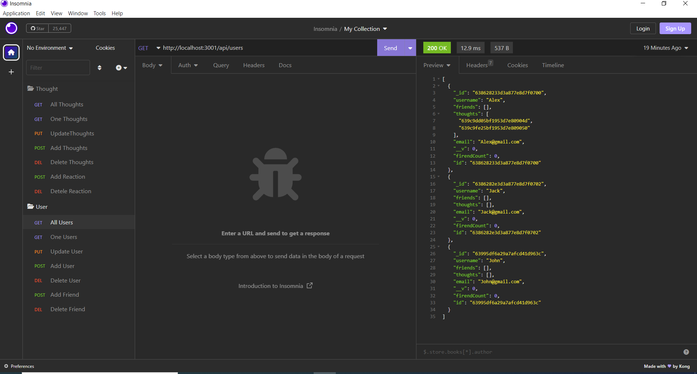

# social-netwrok-api

## social-netwrok-api is a web application to share thought and react
Users can share their thoughts, react to friends’ thoughts, and create a friend list. 
MongoDB used in this app which is a popular choice for many social networks due to its speed with large amounts of data and flexibility with unstructured data.

Technology: Express.js for routing, a MongoDB database, and the Mongoose ODM. 

## Contributions

Made by John Aslani

## License: MIT

This program licensed under [MIT](https://img.shields.io/badge/license-MIT-blue)

## Screenshot

## [Walkthrough video 1, all except delete reaction to thought](https://drive.google.com/file/d/1rLXBqJQQgEQrcYIEKAvaRSGcsG0ofWR5/view?usp=share_link)

## [Walkthrough video 2, reaction to thought](https://drive.google.com/file/d/1zEFM92MgPsisB5UoJBGbChi8ADGbGOyI/view)

## Questions

For further information see [my GitHub](https://github.com/johnaslani) or [Weather-Dashboard](https://github.com/johnaslani/social-netwrok-api)

Should you have any questions, please reach me at [aslani.john@gmail.com](mailto:aslani.john@gmail.com)